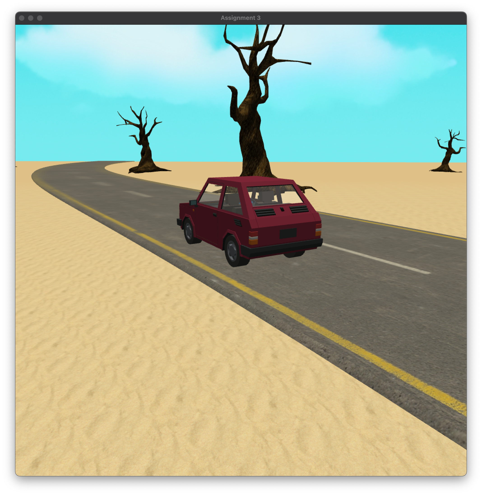
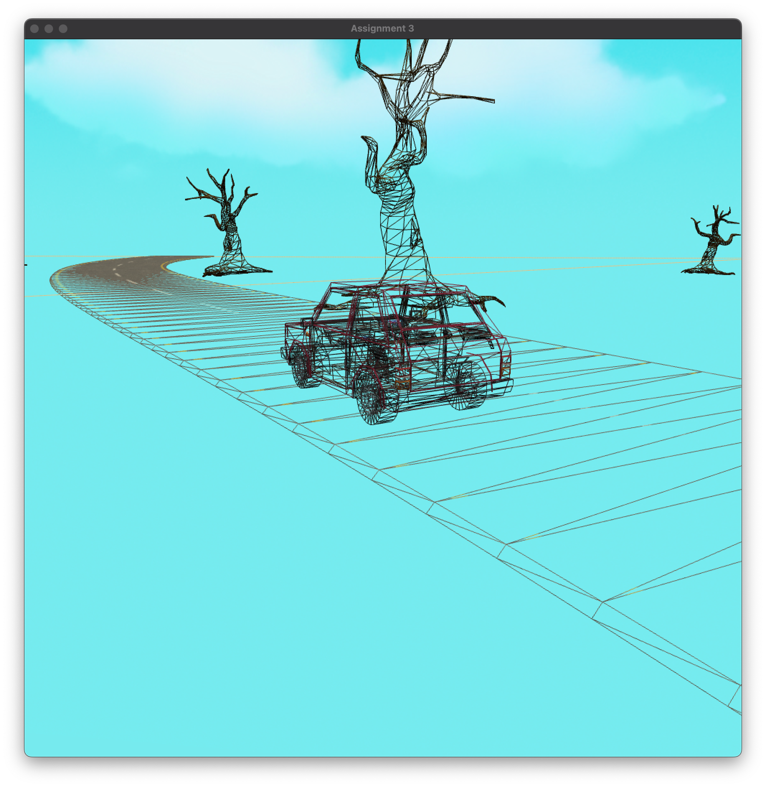
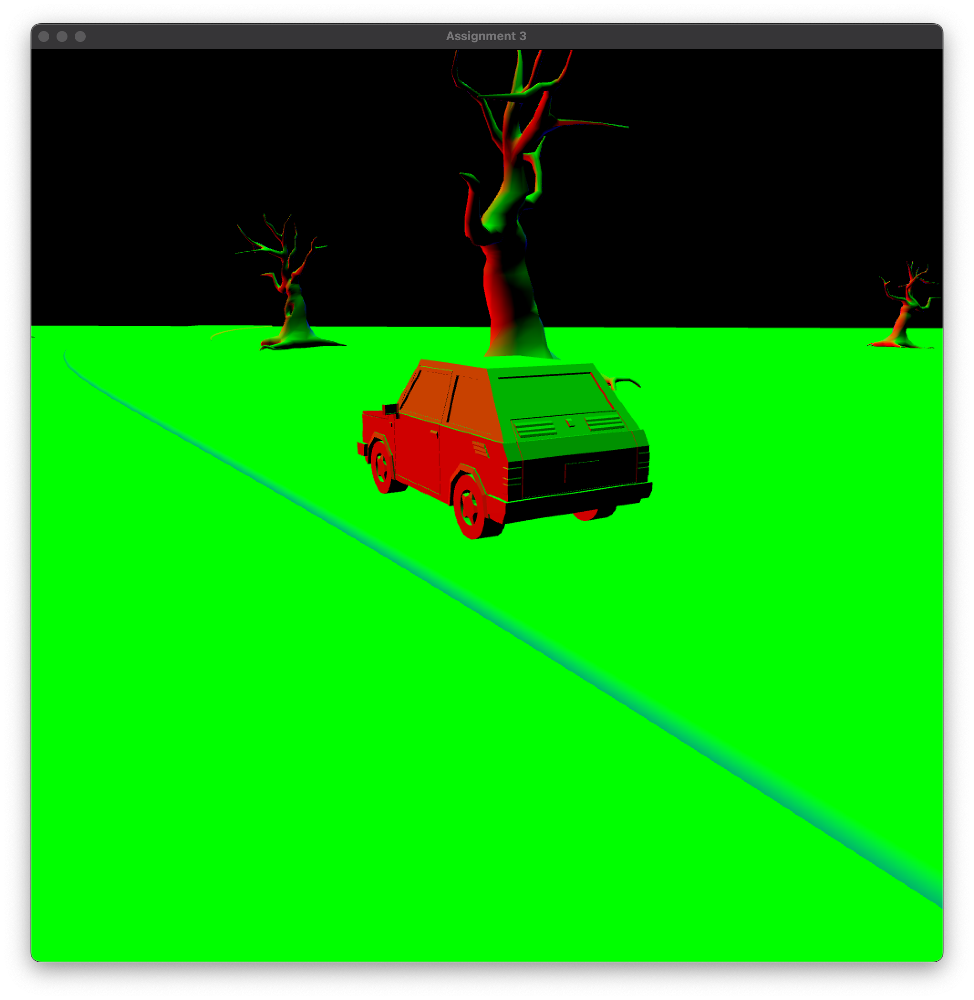

# 2026 Session 1 – COMP3170: Computer Graphics
## Assessment Task 3: 3D Interactive Visualisation

| Submission details					|    | 
| --------------------------------------| -- |
| Due Date 								| 11:59pm, Jun 7 2026, Week 13 |
| Weighting								| Assessment will be marked out of a total of 100 marks. This assessment will contribute to 40% of overall unit grade. |
| Time to complete						| This assessment will take approximately 30 hours per person to complete. |
| Length & Format						| Java Source code and Markdown Report |
| Late Penalties						| Standard late penalty applies. |
| How to Submit 						| Java source and report via GitHub Classroom. Peer assessment via iLearn. |
| Return of Assessment Grade & Feedback	| Grades will be returned after result finalisation via iLearn with feedback given within.  |
| Purpose								| The purpose of this task is to practice the use of 3D transformations and shader programming to implement a 3D scene with lighting and visual effects. |
| Learning Outcomes Assessed			| ULO1: Understand the fundamentals of vector geometry and employ them in devising algorithms to achieve a variety of visual effects. |
|                                       | ULO2: Implement a standard render pipeline to transform a 3D scene into a 2D image. |
|                                       | ULO3: Apply matrices to implement and combine 3D transformations including rotation, translation, scale and perspective. |
|                                       | ULO4: Program vertex and fragment shaders to implement effects such as lighting, texturing, shadows and reflections. |
|                                       | ULO5: Communicate how advanced graphical algorithms operate through appropriate equations and geometrical diagrams. |
| Skills assessed						| Using the methods and tools described in Lectures and Workshops, this task allows you to demonstrate: |
|                  						| 1. Your ability to generate and transform 3D meshes in Java. |
|                  						| 2. Your ability to write shader code to light 3D scenes. |
|                  						| 3. Your ability to explain the design of your code in written documents and oral presentation |
| How will this task be assessed? 		| This is a pair task. Individual marks will be assessed based on peer assesssment and viva in Week 13. |
| Use of AI								| Open. AI may be use to assist in writing the code for this assignment, but you are still expected to understand how the code works and explain it clearly. |
| Short automated extensions			| Accepted |

# Task overview
For this assessment, you will implement an interactive 3D scene in Java using OpenGL and document the design of your code.

## Objectives
This assignment covers the following topics:
* 3D modelling with triangular meshes
* 3D Transformations
* Perspective & Orthographic cameras
* Viewport & Scissor rectangles
* Vertex and Fragment shaders
* Illumination and shading
* Texturing
* Screen-space effects

## Contents
- [2026 Session 1 – COMP3170: Computer Graphics](#2026-session-1--comp3170-computer-graphics)
  - [Assessment Task 3: 3D Interactive Visualisation](#assessment-task-3-3d-interactive-visualisation)
- [Task overview](#task-overview)
  - [Objectives](#objectives)
  - [Contents](#contents)
- [Task details](#task-details)
  - [Framework](#framework)
  - [Requirements](#requirements)
    - [General requirements](#general-requirements)
    - [World space](#world-space)
    - [Features](#features)
    - [Debug modes](#debug-modes)
    - [Desert](#desert)
    - [Road](#road)
    - [Trees](#trees)
    - [Car](#car)
    - [Cameras](#cameras)
    - [Lighting](#lighting)
    - [Skyboxes](#skyboxes)
    - [Effects: Heat shimmer (*Challenge*)](#effects-heat-shimmer-challenge)
  - [Documentation](#documentation)
- [Submission](#submission)
  - [Eclipse project](#eclipse-project)
  - [Viva](#viva)
  - [Peer assessment](#peer-assessment)
- [Quality Criteria](#quality-criteria)
    - [Rubric](#rubric)

# Task details

This is a two-person group assignment. Your task is to build a 3D scene of a car driving through a desert: 

## Framework
An Eclipse project containing a Java framework for the assignment is available via the GitHub classroom link on iLearn. This includes the model files and textures you will use. 

Code has been provided to allow you to load models from a Wavefront OBJ file:
* `ObjData.java` - The OBJ loader
* `Mesh.java` - Mesh data (vertices, normals, uvs, indices)
* `Material.java` - Unused.
* `Tree.java` - Demonstration code, loading the `tree.obj` file. 

You are free to edit this code if you desire.

## Requirements

### General requirements
Your scene should be implemented using:
* Anti-aliasing using 4x multisampling.
* Backface culling
* Mipmaps for all textures (with trilinear filtering)
* Gamma correction (with a default gamma of 2.2)

Correctness marks will be deducted if these not implemented correctly.

### World space

World space should be oriented so that the the j axis (i.e. the y coordinate) points upwards. The directions of the i and k axes can be set as you deem appropriate.

For all world-unit calculations, 1 unit in world space should be equal to 1 metre. 

### Features

| Feature | Marks | 
| ------- | ----- |
| Debug modes                   |    |
| - Wireframe mode              | 3% |
| -  Normals mode               | 3% |
| Desert                        |    |
| - Mesh & normals              | 3% |
| - UVs & texture               | 3% |
| Road	                        |    |
| - Mesh & normals              | 4% |
| - Bezier mesh (*Challenge*)   | 8% |
| - UVs & texturing             | 4% |
| Trees                         | 2% |
| Car                           |    |
| - Meshes & normals            | 3% |
| - UVs & Textures              | 3% | 
| - Window Transparency         | 3% |
| - Driving                     | 3% |
| - Wheels                      | 3% |
| - Animating wheels	          | 3% |
| Cameras                       |    |
| - Map                         | 4% |
| - Third-person                | 4% |
| Light                         |    |
| - Day – Sun (diffuse & ambient)   | 4% |
| - Day – Sun (specular)            | 4% |
| - Night – Headlights (point)      | 4% |
| - Night – Headlight cone	        | 4% |
| Skybox                            | 4% |
| Effects- Heat shimmer (*Challenge*)    | 4% |	
| Report                            | 20% | 
| **Total**                         | 100% |

**Note**: 
* The features labelled (*Challenge*) are more difficult, and require advanced techniques or concepts.

The individual features for the assignment are described in detail below. Any requirement labelled **Document** indicates something that should be included in your report.

### Debug modes

#### Wireframe view

* Pressing ‘4’ should toggle between filled and wireframe views of all the meshes in the scene. 

#### Normals view

* Pressing ‘5’ should toggle on and off a mode in which all objects are shaded to display their normals in world coordinates (using a normal matrix), where the RGB colour values are equal to the normal coordinates (r,g,b) = (n_x,n_y,n_z).

    
### Desert
#### Mesh & Normals

* The desert should be a flat, horizontal 100x100m square mesh centred at the origin of world space.
* Vertex normals should be specified pointing directly upwards.

#### UVs and texturing

* Appropriate vertex UVs should be calculated for each vertex in the mesh.
* One unit of texture space should map to 1m of world space.
* The `sand.jpg` texture (in the `textures` folder) should be used to colour the mesh.

### Road

There are two options for constructing the road mesh, worth different amounts of marks. You can attempt either of these, but cannot claim marks for both.

1. **Straight**: The road should consist of three straight segments, connecting the points (-25,0,-50), (-25,0,-25), (25,0,0), (25,0,50), as shown in the first below.
2. **Bezier curve**: The road should follow a cubic Bezier curve with control points (-25,0,-50), (-25,0,-25), (25,0,0), (25,0,50), as shown in the second below.

#### Mesh & normals

* The road mesh should have a trapezoidal cross-section, as shown in the image above.
  * The flat top should have a constant width of 8m.
  * The road should be raised 0.1m above the desert.
  * The edges of the road should slope downwards at a 45 degree angle to meet the desert surface.
* The mesh should be generated in code, rather than by hand, and should work for any sensible choice of the above control points.
* The mesh should have appropriate normals.
* **Document**: Illustrate how you calculate the road mesh.

#### Bezier curve

* The road should follow a cubic Bezier curve with the control points given above.
* Extrude the cross-section shown above along this curve to create the road mesh (as shown in the week 5 lecture video).
* The tangent vector to the Bezier curve for a parameter $t \in (0,1)$ is given by the function:

$$B'(t) = 3(1-t)^2 (P_1 - P_0) + 6t(1-t)(P_2 - P_1) + 3t^2 (P_3 - P_2)$$

* Normals should be converted from cross-section space to model-space using a normal matrix computed from the extrusion martix.

#### UVs and Textures

* The road should be textured using the `road.jpg` texture provided.
* UVs should be calculated so that the texture repeats for every 16m of distance along the road. 

### Trees

Example code has been provided to load the tree mesh from the Wavefront OBJ file `tree.obj` (in the `models` folder). The model includes a submesh `Tree` with vertices, normals and UVs.

* Several (more than 3) trees should be placed in the world at different positions, rotations, and scales.
* The `tree.png` texture (in the `textures` folder) should be applied to the trees.

### Car

The car model is given to you as a Wavefront OBJ file `car.obj` (in the `models` folder). The model includes three submeshes:
* `Body` – the outer body of the car.
* `Interior` – the seats & other items inside the car
* `Windows` – the car windows.

Each of these meshes shares the same model coordinate frame (i.e. they can all be drawn with the same model matrix). Model space coordinates for the car are scaled so 1 unit = 1 metre.

#### Mesh & Normals
* The car (with all three submeshes) should initially be drawn at the centre of the map.
* The car model is in US layout (steering wheel on the left). Flip the model so it is in Australian layout (steering wheel on the right).

#### UVs and texturing
Texture coordinates (UVs) for the car are specified in each of the submeshes. 
* Use these coordinates to texture each part using the `car.png` texture provided (in the `textures` folder). All submeshes use the same texture.

#### Window Transparency
* The window submesh of the car should be rendered using alpha-blending to allow you to see in and out of the car. Use an alpha value of 0.2.

#### Driving
The car should be controlled using the WASD keys:
* Pressing W and S should make the car move forward and backward at a constant speed.
* Pressing A and D should make the car turn left and right.

#### Wheels 
A separate OBJ file `wheel.obj` is provided (in the models folder) containing the model for a single wheel of the car.

* Attach four copies of this model to your car at the following coordinates in the car’s model space:
    * Front left: (0.62, 0.35, 1.3) 
    * Front right: (-0.62, 0.35, 1.3)
    * Back left: (0.62, 0.35, -1.15)
    * Back right: (-0.62, 0.35, -1.15) 
* Make sure the wheels are rotated correctly so the hubcaps face outwards.      
* Wheels should be textured using the `car.png` texutre provided (in the `textures` folder).

#### Wheel rotation
* The wheels should rotate in the correct direction and speed to match the movement of the car.
* The left and right front wheels should turn left and right to match the steering of the car.

### Cameras
There are two different main camera modes: 
* Pressing 1 enables the **Map** camera.
* Pressing 2 enbales the **Third person** camera.

#### Map camera (orthographic)
* The map camera is a top-down orthographic view of the map.
* The map should be centred in the window.
* Resizing the window should make the map larger or smaller.
* If the aspect of the window does not match the aspect of the map, then black bars should be drawn on the left and right or top and bottom depending on whether the window is too wide or too tall.
* Near and far planes should be set so the entire map is visible 
* **Document**: Illustrate the viewport and scissor rectangle for this camera a window with resolution 800x600 pixels. Label the corners of each rectangle with coordinates in screen space, NDC, World and Viewport coordinates.

#### Third-person camera
* The third-person camera is a perspective camera that follows the car from an external point of view.
* The camera should always face towards the car’s position in world space and maintain a constant distance from the car’s origin.
* The following keys should control the camera:
  * Pressing the Left and Right arrow keys should rotate the camera clockwise and anticlockwise around the car, respectively.
  * Pressing the Up and Down arrow keys should pitch the camera up and down, to a maximum of plus or minus 90 degrees (i.e straight up or straight down).
  * Pressing the '.' (period) and ',' (comma) keys should dolly the camera towards and away from the car.
  * Pressing Page Up and Page Down keys should zoom the camera in and out (i.e. change the field of view of the camera) between sensible minimum and maximum values. 
* Resizing the window should change the aspect of the camera view volume to match, without affecting the vertial field of view.
* Near and far planes should be set so the entire car is visible, as well as some of the surrounding landscape.
* **Document**: Illustrate how you calculate the position and view volume of the third-person camera.

### Lighting
There should be two modes: Day and Night. The lights in the scene change depending on which mode.
* Pressing the 3 key switches between Day and Night

#### Day – Sun (diffuse & ambient)
During the day:
* The sky should be blue.
* All objects should be lit with appropriate ambient and diffuse light.
* Lighting calculations should be done using a directional light representing the sun.
* Pressing the '[' key rotates the direction of the sun from east to west.
* Pressing the ']' key rotates the direction of the sun from west to east.
* **Document**: Illustrate how the lighting value for a point on the desert is calculated, for the third-person camera.

#### Day – Sun (specular)
* The body and windows (but not the interior) of the car should include specular highlights that reflect the sun.
* **Document**: Illustrate how the specular lighting for the car’s windscreen is calculated when lit by the sun and viewed using the third-person camera.

#### Night – Headlight (diffuse & ambient)
During the night:
* The sky should be black.
* Lighting calculations should be done using a point light attached to the front of the car at (0, 0.93, 2.1) in the car's model space.
* Only a single light needs to be used, rather than one per headlight.
* All objects should be lit with appropriate ambient and diffuse light.
* **Document**: Illustrate how the lighting value for a point on the desert is calculated, for the third-person camera.

#### Night – Headlight cone
* The Headlight should emit light along a 60-degree cone pointing in the forward direction. Objects outside of the cone should not be lit. 
* Only a single light cone needs to be shown, rather than one per headlight.
* The intensity of the light should drop with distance from the source, following the equation: $I = I_{max} * min(1, 1 / d)$, where $I_{max}$ is the maximum intensity and $d$ is the distance from the light source to the lit point.
* **Document**: Illustrate how you calculate whether an object is lit by the headlight

### Skyboxes
Textures have been prodvided for two skyboxes `jettelly_no_moon_XXX.png` for Night and `jettelly_sunshine_XXX.png` for Day (in the `textures/skies` folder).
* Display each skybox in the corresponding Day/Night mode.
* Skyboxes should be drawn behind all other objects in the scene.
* Skyboxes should follow the camera position (but not rotation), as described in lectures.

### Effects: Heat shimmer (*Challenge*)
* Using a screen-space effect, add a 'heat shimmer' during the Day.
* The shimmer should distort the view in animated waves rising up the screen.
* See [this video](https://echo360.net.au/media/04b54547-42de-4539-a110-8b5051fae80e/public) for an example of this effect.
* You are free to interpret this requiment as you see fit, but should demonstrate your ability to use screen-space effects appropriately.
 
## Documentation

You should complete the template report provide as `Report.md` in the repository. The report should include a completed table indicating the features you have attempted, as well as the per-feature documentation required above.

Documentation is marked separately from implementation but should reflect the approach taken in your code. You can attempt documentation questions for features you have not implemented or completed but should indicate where this is the case.

Documentation should include both diagrams and relevant equations to explain your solution. 

**Note**: Copy/pasting images directly from the lecture notes (or other sources) will get zero marks (and may be treated as academic misconduct).

Document marks will be assigned per-question as:

| Feature | Marks |
|---------|-------|
| Scene graph | 2% |
| Road - Mesh | 3% |
| Lighting - Day - Diffuse & Ambient | 3% |
| Lighting - Day - Specular | 3% |
| Lighting - Night - Diffuse & Ambient | 3% |
| Lighting - Night - Headlight cones | 2% |
| Cameras - Map | 2% |
| Cameras - Third-person | 2% |
| **Total** | 20% |

# Submission

## Eclipse project 

Your project will be submitted using Github Classroom. Your most recent commit to the repository before the assignment deadline will be marked. Use the commit message `Final Submssion` to make it clear that you are submitting your work.

## Viva

As part of this assessment, you will deliver a **viva** in your Week 13 SGTA. Your TA will interview you and your programming partner, so ensure you are both present. 
* A separate session is also available during the Week 13 lecture time if you are unable to make this time. This requires booking through iLearn.
* Each team member should identify a major component of the assignment (e.g. the road mesh, the cameras, or the lighting shaders) that they are leading the development on, and be prepared to answer questions about progress, methods used, relevant course content, and the plan for the last few days of development.
* The expectation during this viva is not that your project will be finished, but that you have begun work and have an active understanding of what you are undertaking.
* Each viva will last for 10 minutes, with 5 minutes per team member. It is important to be mindful of this time, and allow your partner space to speak. Please do not interrupt or speak for your partner, nor defer to them to answer for you.
* Insights gained during the viva process will be used to determine final, individual marks for the task, as well as contribute to relevant rubric items.
  
## Peer assessment
You will also submit individual **peer assessment** reports, using the form provided on iLearn, to assess both your own contribution and that of your teammate. You need to provide a grade (following the rubric given in the template) and a justification for the grade. This grade will be kept private from your teammate but will be used as evidence to adjust the final individual grade weighting. 

# Quality Criteria
A high-quality submission is:
* Correctly implemented, making appropriate use of the OpenGL and JOML libraries in Java, and GLSL functions in shaders.
* Clearly implemented, with code that well structured and easy to follow. 
* Clearly documentated, with appropriate use of diagrams and equations to convey the geometrical and mathematical details of the code.

### Rubric

Your final mark will be determined using the following formula:

#### Code
Each feature attempted by you will be marked using the rubric below.
|Criteria|Grade|Description|
|-|-|-|
|Correctness (50%) |HD (100)|Code relevant to feature is free from any apparent errors. Problems are solved in a suitable fashion. Contains no irrelevant code.|
||D (80)|Code relevant to feature has minor errors which do not significantly affect performance. Contains no irrelevant code.|
||CR (70)|Code relevant to feature has one or two minor errors that affect performance. Problems may be solved in ways that are convoluted or otherwise show lack of understanding. Contains some copied or generated code that is not relevant to the problem.|
||P (60)|Code relevant to feature is functional but contains major flaws. Contains large passages of copied or generated code that are not relevant to the problem.|
||F (0-40)|Code relevant to feature compiles and runs, but major elements are not functional.|
|Clarity (50%) |HD (100)|Good consistent style. Well structured & commented code relevant to feature. Appropriate division into classes and methods, to make implementation clear.|
||D (80)|Code relevant to feature is readable with no significant code-smell. Code architecture is adequate but could be improved.|
||CR (70)|Code relevant to feature is readable but has some code-smell that needs to be addressed. Code architecture is adequate but could be improved.|
||P (60)|Significant issues with quality of code relevant to feature. Inconsistent application of style. Poor readability with code-smell issues. Code architecture could be improved.|
||F (0-40)|Significant issues with quality of code relevant to feature. Inconsistent application of style. Poor readability with code-smell issues. Messy code architecture with significant encapsulation violations.|

#### Documentation
Each component of your documentation will be marked using the rubric below.

|Grade|Description|
|-|-|
|HD (100)|Illustrations are neat, clear and well annotated. Relevant equations are provided and clearly annotated. No discrepancies between explanation and code (except as noted).|
|D (80)|Illustrations are neat and clear. Relevant equations are provided. No discrepancies between explanation and code (except as noted).|
|CR (70)|Minor sloppiness or missing detail. Equations are provided but include minor inaccuracies. Minor discrepencies between documentation and code.|
|P (60)|Significant sloppiness or missing detail. Equations are provided but include major inaccuracies. Values in illustrations show understanding of task, but may not reflect code.|
|F (0-40)|Illustrations are unclear and badly drawn. Does not make use of graph paper. Equations are not provided or are not relevant to explanation.|

					
