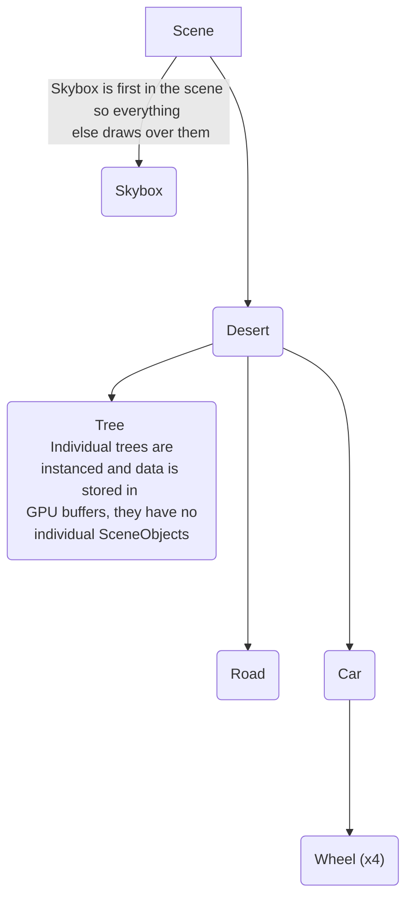
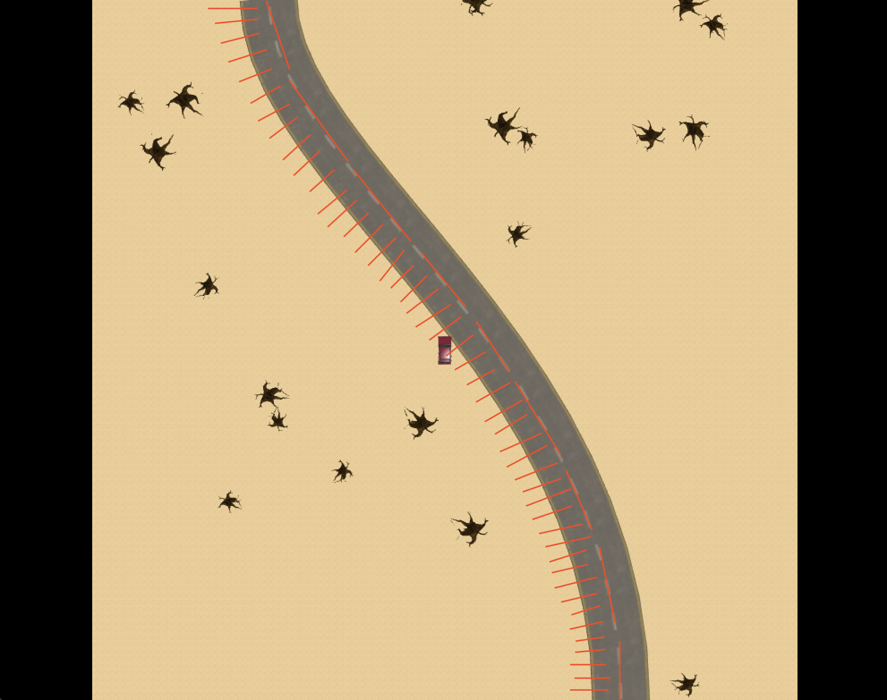
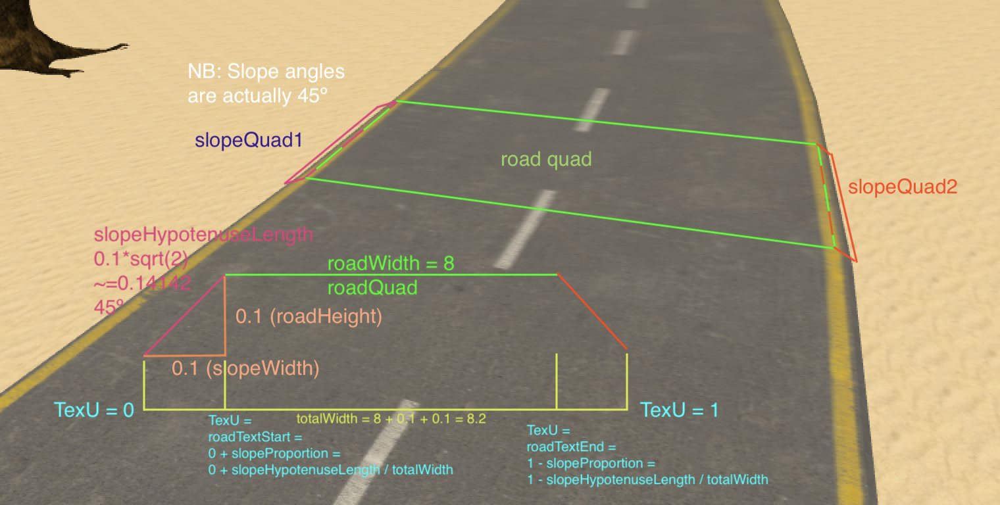
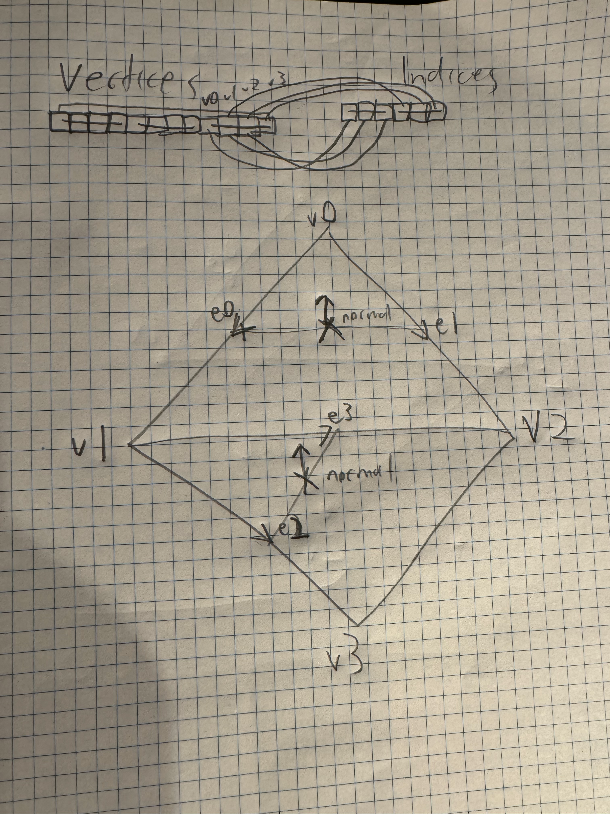
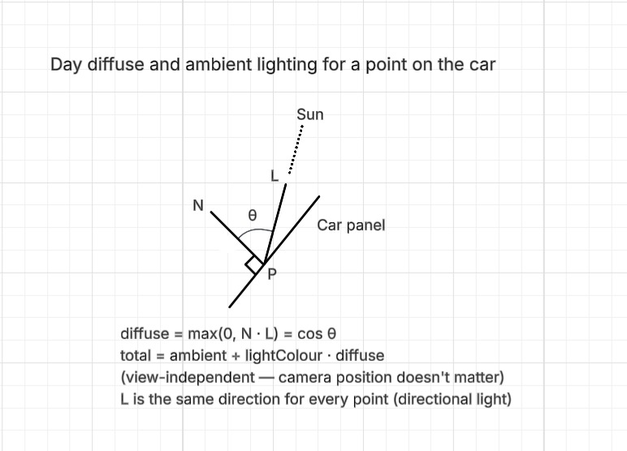
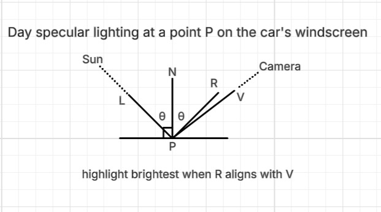
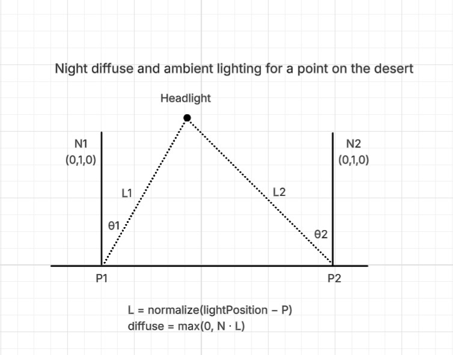
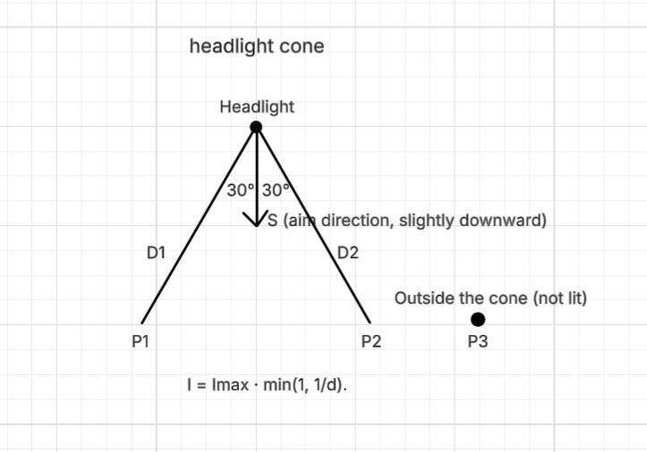

# COMP3170 Assignment 1 Report

### Student 1 Name: [Cadigal]
### Student 1 ID: [47100192]

### Student 2 Name: [Tanish]
### Student 2 ID: [47896345]

## Your Development Environment
### Cadigal (47100192)

| Spec                                                | Answer                                                                  |
|-----------------------------------------------------|-------------------------------------------------------------------------|
| Java JDK version used for compilation               | Amazon Corretto 21.0.3 AArch64                                          |
| Java compiler compliance level used for compilation | 21 - Record patterns, pattern matching for switch                       |
| Java JRE version used for execution                 | Same as JDK                                                             |
| Eclipse version                                     | N/A, IntelliJ IDEA 2024.2.4 (Community Edition) Build #IC-242.23726.103 |
| Your screen dimensions (width x height)             | 2560x1600 13.3 inch Retina display (4 sub pixels per pixel)             |
| Your computer type (Mac/PC)                         | MacBook Air                                                             |
| Your computer make and model                        | M1, 2020, 16GB                                                          |
| Your computer Operating System and version          | OSX Tahoe 26.1 (25B78)                                                  |

### Tanish (47896345)

|Spec|Answer|
|----|-----|
|Java JDK version used for compilation|22.0.2|
|Java compiler compliance level used for compilation|21|
|Java JRE version used for execution| 22.0.2 (build 22.0.2+9-70)|
|Eclipse version|Version: 2026-03 (4.39.0)|
|Your screen dimensions (width x height)|1920 x 1080|
|Your computer type (Mac/PC)|PC|
|Your computer make and model|Acer Nitro AN515-45|
|Your computer Operating System and version|Windows 11 Home Single Language, 25H2|

## Features Attempted
Complete the table below indicating the features you have attempted. This will be used as a guide by your marker for what elements to look for, and dictate your <b>Completeness</b> mark.

| Feature                             | Attempted | 
|-------------------------------------|-----------|
| Debug modes                         |           | 
| - Wireframe mode                    | YES       |
| -  Normals mode                     | YES       |
| Desert                              |           |
| - Mesh & normals                    | YES       |
| - UVs & texture                     | YES       |
| Road                                |           |
| - Mesh & normals                    | YES 	  |
| - Bezier mesh (*Challenge*)         | YES 	  |
| - UVs & texturing                   | YES 	  |
| Trees                               | YES 	  |
| Car                                 |           |
| - Meshes & normals                  | YES       |
| - UVs & Textures                    | YES       |
| - Window Transparency               | YES       |
| - Driving                           | YES       |
| - Wheels                            | YES       |
| - Animating wheels                  | YES       |
| Cameras                             |           |
| - Map                               | YES       |
| - Third-person                      | YES       |
| Light                               |           |
| - Day – Sun (diffuse & ambient)     | YES 	  |
| - Day – Sun (specular)              | YES 	  |
| - Night – Headlights (point)        | YES 	  |
| - Night – Headlight cone            | YES 	  |
| Skybox                              | YES       |
| Effects- Heat shimmer (*Challenge*) | YES       |

# Documentation

Documentation is marked separately from implementation but should reflect the approach taken in your code. You can attempt documentation questions for features you have not implemented or completed, but should clearly indicate that this is the case. 

Documentation should include both diagrams and relevant equations to explain your solution. 

**Note**: Copy/pasting images directly from the lecture notes (or other sources) will get zero marks (and may be treated as academic misconduct).

Where requested, meshes should be drawn to scale in model coordinates, including:
* The origin
* The X and Y axes
* The coordinates of each vertex
* The triangles that make the mesh

## Scene Graph

* Include a drawing (pen-and-paper or digital) of the scene graph used in your project.
* Where there are multiple copies of an object at the same point in the graph (e.g. the trees) only a single instance needs to be shown.

There are a few other things in the `Scene` class that are not SceneObjects and therefore not strictly part of the SceneGraph:
1. Light
1. Third Person (Perspective) Camera
1. Map (Orthographic) Camera
1. Free (Flight) Debugging Camera
1. ActiveCamera - points to the currently selected camera (one of the other three cameras)

## Road Mesh

Illustrate how you construct the road mesh, including:
* vertices
* normals
* construction into triangles in the index buffer

Vertices:
1. The Bézier curve is sampled at a number of points
2. The road is made up of a number of segments (a start point and the following end point on the Bézier curve)
3. For each segment, perpendicular normal vectors are generated (pictured)
4. For each segment, a road quad is generated from the start point to the end point, with vertices extended/extruded by half the road width laterally on each side along the perpendicular normal, creating a quad spanning the whole segment
5. Using similar extrusion, quads for the slopes on either side are added

Normals:
1. Normals for the road top are trivial, they point directly up, and were originally hardcoded. 
2. Normals for the slopes are more involved, as the quads aren't pointing directly on 1 axis. 
3. Therefore, all normals are automatically calculated:
4. Each quad is split into two triangles along the v1-v2 diagonal. 
5. For each triangle, two edge vectors are computed from a shared corner. 
6. The cross product of two edge vectors produces the triangle normal. 
7. The corner vertices (v0, v3) each belong to only one triangle, so they take that triangle's normal directly. 
8. The shared vertices (v1, v2) each belong to both triangles, so the normals are averaged together, so that if the quad was bent (they aren't in this case though), lighting would still be smooth over the bend.

Indexing:
1. The vertices are stored in an array that can be though of as being indexed in two dimensions `[segment][quad]`. 
2. Indexing is done by stepping through every four vertices (single quad) and adding six indices (two triangles). 
3. Vertices between quads are not shared, even though there are vertices with the same position as vertices in other quads, as the UVs differ. 
4. Each segment has 12 unique vertices (3 quads * 4 vertices per quad).

## Lighting

All lighting is computed per-fragment in `simple.frag` (and `instanced_fragment.glsl` for the Trees) using the world-space surface
normal from the vertex shader, following the Phong model (ambient + diffuse + specular).
Day / Night modes are toggled with `3` and select which light is active. Texture
colours are decoded to linear (`pow(colour, 2.2)`) before lighting and the final result
is gamma-encoded (`pow(result, 1/2.2)`) for display.
 
---
 
## 1. Day – Diffuse & Ambient for a point on the car
 
During the day the scene is lit by a **directional light** representing the sun. It is
infinitely far away, so its rays are parallel and it is described by a single direction
shared by the whole scene (a direction only, no position).
 
A point on the car is lit by an **ambient** term plus a **diffuse** term.
 
The **diffuse** term measures how directly the surface faces the sun, using the dot
product of the unit surface normal **N** and the unit direction to the light **L**,
clamped to be non-negative:
 
    diffuse = max(0, N · L)
 
Since N and L are unit vectors, N · L = cos θ, where θ is the angle between them. A car
panel facing the sun (θ = 0°) is fully lit; as it turns away the value drops; once it
faces away, max(0, …) clamps it to 0. Unlike the flat desert, a point on the car has a
normal N that points in whatever direction that panel faces (the bonnet up-and-forward, a
door sideways, etc.), so different panels receive different light — this is what makes the
car read as a 3-D shape. As the car drives and turns, each panel's normal changes relative
to the fixed sun direction, so panels brighten and darken.
 
The **ambient** term is a constant colour added everywhere regardless of orientation,
approximating scattered skylight so unlit panels are not pure black. The ambient intensity
is **(0.25, 0.25, 0.25)**, chosen so shadowed panels stay faintly visible.
 
The terms are summed and multiply the (linear) texture colour:
 
    lighting    = ambient + lightColour · max(0, N · L)
    finalColour = textureColour · lighting
 
(The car body also adds the specular)
 
**Third-person camera:** diffuse and ambient are view-independent — they depend only on
the panel's normal and the sun direction, not the camera. A given car point looks the same
brightness from any third-person camera position.

## 2. Day – Specular for a point on the car

Specular highlights are the bright glints seen on glossy surfaces such as the
car's paint and windscreen. Unlike diffuse, specular **depends on the camera
position**, because a highlight appears only where the sun reflects off the
surface directly toward the viewer. The car's **body and windows** receive
specular highlights; the **interior does not**, since matte surfaces do not glint.

Three unit directions at the surface point are used:

- **N** – the surface normal.
- **L** – the direction to the sun.
- **V** – the direction from the surface point to the camera:
  `V = normalize(cameraPosition − surfacePosition)`.

The sun direction is reflected about the normal to give the reflection direction **R**:

    R = reflect(−L, N)

The incoming ray travels in direction −L (from the sun towards the surface), so it
is negated before being reflected about the normal. The highlight is brightest when
the reflected ray **R** points towards the camera — that is, when **R** and **V**
are aligned. This alignment is measured by their dot product, clamped to be
non-negative and raised to a shininess exponent:

    specular = lightColour · max(0, R · V) ^ shininess

The shininess exponent (32 in this implementation) controls how tight the highlight
is: a higher exponent gives a smaller, sharper glint, while a lower one gives a
broader, softer sheen. The specular term takes the colour of the light rather than
the surface, so the glint on the dark-red car appears white. It is added on top of
the ambient and diffuse result:

    finalColour = textureColour · (ambient + lightColour · max(0, N · L)) + specular

**Third-person camera:** because **V** is computed from the camera position, the
specular highlight slides across the windscreen as the third-person camera orbits
the car — it appears wherever the sun's reflection currently points towards the
camera. The camera's world position is obtained from the translation column of the
third-person camera's camera-to-world matrix.

*Figure 2: Day specular lighting at a point P on the car's windscreen, showing the
normal N, the direction to the sun L, the reflected direction R, and the direction
to the camera V. The highlight is brightest when R aligns with V.*

## 3. Night – Diffuse & Ambient for a point on the desert

At night the sky is dark and the only light is a **point light** representing the
car's headlight. It is positioned at **(0, 0.93, 2.1)** in the car's model space
(just above and ahead of the front bumper). Its world position is recomputed each
frame by transforming this model-space point by the car's model-to-world matrix
together with a 180° rotation about the Y axis to match the car's orientation, so
the light moves and turns with the car.

A point light has a **position** and radiates outward, so unlike the directional
sun the direction to the light is **different for every surface point**. For a
desert point at world position **P**, the direction to the light is:

    L = normalize(lightPosition − P)

The desert is flat, so its surface normal is **N = (0, 1, 0)**. The diffuse and
ambient calculation is then the same form as in day mode:

    lighting    = ambient + lightColour · max(0, N · L)
    finalColour = textureColour · lighting

The key difference from the sun is that **L** is computed per point from the
headlight's position, so the desert is lit only near the car, and the lit region
follows the car as it drives. (The intensity is additionally restricted to a
forward cone and falls off with distance — see Section 4.) Ambient is still added
everywhere, so areas outside the beam remain dim rather than fully black.

**Third-person camera:** the diffuse and ambient value of a desert point depends
only on its position and normal and on the headlight's position — it is
view-independent. The camera changes only what is visible, not how bright each
point is.

*Figure 3: Night diffuse and ambient lighting at a point P on the desert. The
direction to the light L is computed per point from the headlight's position
(L = normalize(lightPosition − P)), unlike the directional sun.*

## 4. Night – Headlight cone

The headlight is modelled as a **spotlight** that lights only points lying within a
**60° cone** aimed in the car's forward direction; points outside the cone receive
no direct light (only ambient). The intensity inside the cone also falls off with
distance from the headlight.

**Cone test.** Two unit directions at the headlight are compared:

- **S** – the direction the headlight points. This is the car's forward direction,
  tilted slightly downward as (0, −0.3, 1) in model space so the beam illuminates
  the road ahead, then transformed to world space by the car's orientation.
- **D** – the direction from the headlight toward the surface point:
  `D = normalize(P − lightPosition)` (equivalently −L).

The angle between **S** and **D** is how far off the beam's centre the point lies.
Since both are unit vectors, their dot product gives the cosine of that angle:
`S · D = cos(angle)`. The full cone is 60° wide, so a point is inside it if it lies
within **30°** (the half-angle) of the centre line. Because cosine decreases as the
angle grows, the test "angle ≤ 30°" becomes:

    point is lit  ⇔  S · D ≥ cos(30°)

If this holds, the point is inside the cone and is lit; otherwise its direct
contribution is set to zero.

**Distance falloff.** For points inside the cone, the intensity decreases with
distance **d** from the headlight, following the specified equation:

    I = Imax · min(1, 1 / d)        where d = length(lightPosition − P), Imax = 1

Far from the light, 1/d is small, so the point is dim; very close (d < 1),
min(1, 1/d) caps the intensity at Imax so it does not grow without bound. This
intensity multiplies the diffuse (and any specular) contribution; ambient is
unaffected, so points outside the cone are dim rather than fully black.

Combined:

    if (S · D ≥ cos 30°):   intensity = min(1, 1/d)
    else:                    intensity = 0
    diffuse = max(0, N · L) · intensity

**Third-person camera:** whether a point lies within the cone depends only on the
headlight's position and aim and the point's position — it is independent of the
camera. The camera simply views the resulting forward-projected beam from behind
the car.

*Figure 4: The headlight cone test. A point is lit only if the angle between the
headlight's aim S and the direction to the point D is within 30° (half of the 60°
cone), i.e. S · D ≥ cos 30°. Intensity falls off with distance as I = Imax·min(1, 1/d).*

## Camera 

* Illustrate the viewport and scissor rectangle for the Map camera for a window with resolution 800x600 pixels. Label the corners of each rectangle with coordinates in screen space, NDC, World and Viewport coordinates.

* Illustrate how you calculate the position and view volume of the Third-Person camera.
